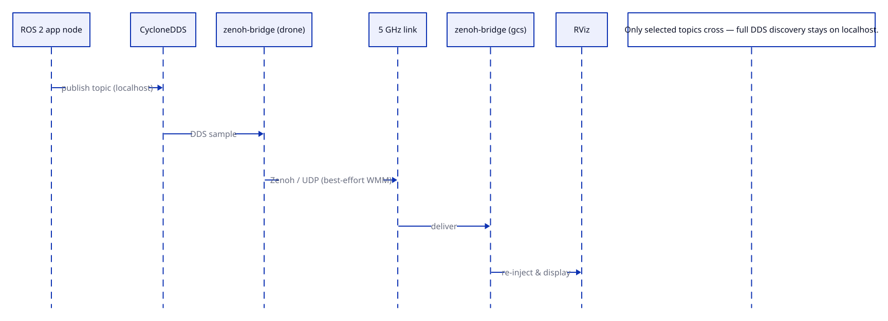
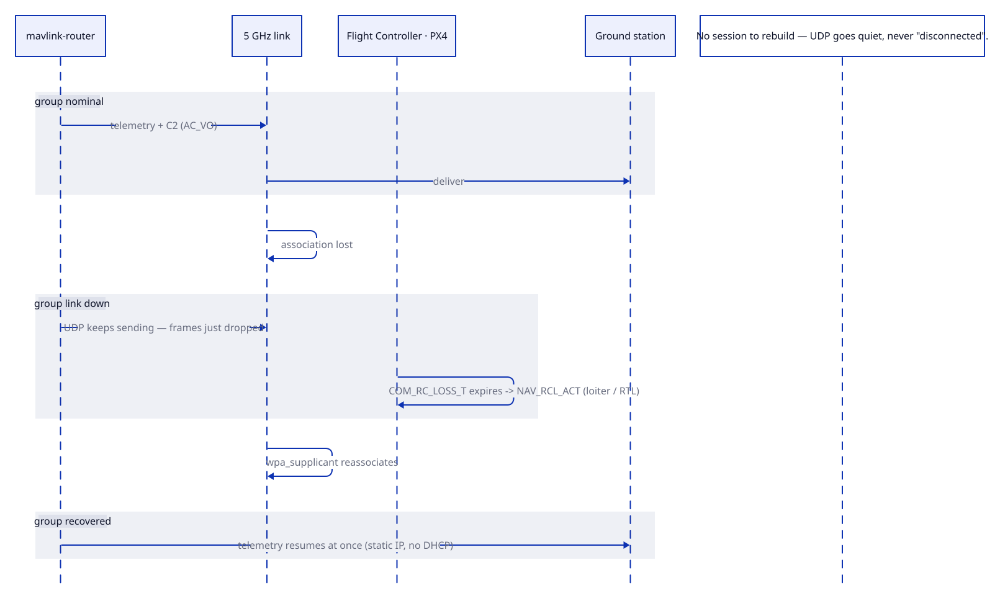

# Drone communication stack — an introduction

The communication stack for an autonomous campus-patrol drone: everything that gets data
between the aircraft and the ground operator. Its job is to carry three very different traffic
classes — command/telemetry, H.265 video, and ROS 2 topics — across a **single 5 GHz Wi-Fi
link**, reliably enough to fly behind and cheaply enough to recover when the link wavers. The
shape that follows from that constraint is a *converged, prioritized, deliberately stateless*
link with the aircraft made safe on its own when the link is gone.

Read the views below in order: the map first, then the map in motion, then why the map looks
the way it does, then where it physically runs.

---

## 1. Structure — what the parts are

The logical decomposition. Three data planes originate on the **drone companion**: ROS 2
application nodes feed CycloneDDS (kept localhost-only) into `zenoh-bridge-ros2dds`;
`mavlink-router` carries command/telemetry from the PX4 flight controller; GStreamer encodes
camera video. All three converge on one **network-provisioning** substrate and cross a single
link to a mirror-image stack on the **ground station**.

**What to notice:** the colour ratio. Exactly one green box per side (your application nodes) is
written from scratch; the orange substrate is shared by all three planes; everything else is a
stolen engine you only configure. The convergence onto one `net` node is the whole design in a
glance.

## 2. Behavior — what happens when it runs

Two scenarios define the system: the happy path it exists for, and the recovery path where its
cleverness lives.

**A ROS 2 topic reaching the ground:**

A topic published on the drone never leaves localhost as DDS — the bridge forwards only selected
topics as Zenoh/UDP across the air, where the ground bridge re-injects it for RViz.
**What to notice:** full DDS discovery never crosses the link; that omission is what keeps the
link usable.

**Link drop and recovery:**

When the association is lost, UDP simply keeps sending into the void (no session to break), PX4's
datalink-loss timer fires an autonomous loiter/RTL, and on reassociation telemetry resumes *at
once* because the IP layer never lost its (static) configuration.
**What to notice:** nothing here "reconnects" in the stateful sense — the design makes loss a
non-event by having nothing to rebuild.

## 3. Rationale — why it's shaped this way

[rationale.md](rationale.md)

Every load-bearing decision, each tagged `[documented]` (explicitly decided in design — a pending
ADR) or `[inferred]` (my reading), with open questions recorded rather than invented. The whole
file hangs off one tension: **one shared, lossy, bandwidth-limited link carrying three conflicting
traffic classes under flight-safety constraints.**
**What to notice:** the recurring move is *subtraction* — no DHCP, no TCP, no roaming, no DFS,
no long video GOP. The link is made tolerant by removing state, not adding recovery code.

## 4. Topology — where it physically runs (situational)

The physical/network view: the PX4 flight controller wired to the NT98690 companion over UART;
the companion as a `192.168.4.1` access point; the ground station associating at `.2` and
NAT-routing the drone to the internet through a *separate* uplink. This is promoted because the
project's deployment difficulty — single-PHY radio roles, addressing, the one shared link — is
real and invisible to the logical Structure view.
**What to notice:** the only wired hop is FC↔companion; every other link is the one contended
5 GHz channel, and the internet path leans on a *second* ground interface, not the flight radio.

---

## Entrypoints — where to start building

This project is at progress 0; the entrypoint is the build sequence, not a `main()`. Start at
the bottom of the stack and climb, gating each layer before the next:

1. **Phase 0 — foundation.** Confirm a serial console that works with Wi-Fi down (the lifeline),
   `git init` the config-as-code repo, snapshot a base image.
2. **Phase 1 — bare IP link (the first commit).** `hostapd.conf` (ch 149, country TW) + static
   `192.168.4.1/24` on the drone; `wpa_supplicant.conf` (pinned BSSID, `bgscan=""`) + static `.2`
   on the ground; `power_save off` both ends. **Done when:** ping both ways, survives a reboot,
   and a forced `iw disconnect` recovers on its own.
3. **Phases 2–6** then stack one plane at a time — reproducible Ansible role → MAVLink →
   video → ROS 2 over Zenoh → QoS last — each with its own gate.

**Key files to create first:** `hostapd.conf`, `wpa_supplicant.conf`, a static-IP + power-save
bring-up script, and a re-runnable `health-check`. The diagrams above are the destination; the
first commit is "two machines ping each other after a reboot, reproducibly."

> Generated as a project-intro: Structure / Behavior / Rationale + one situational view
> (topology), drawn from the architecture discussion rather than a repo survey.
